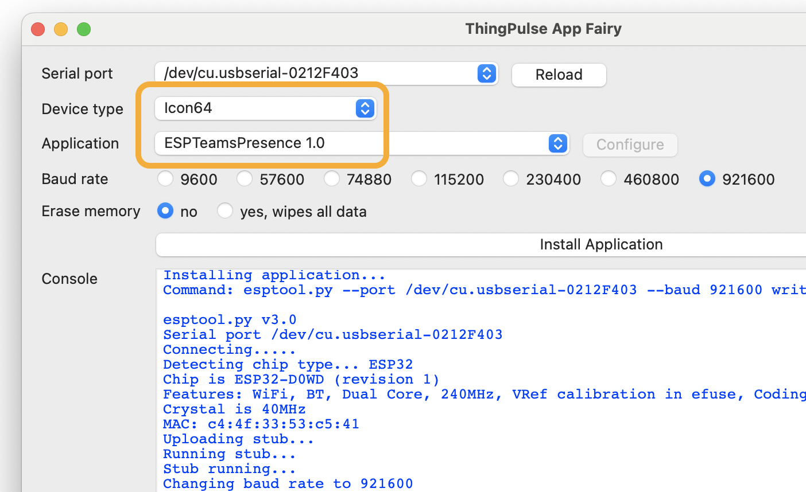
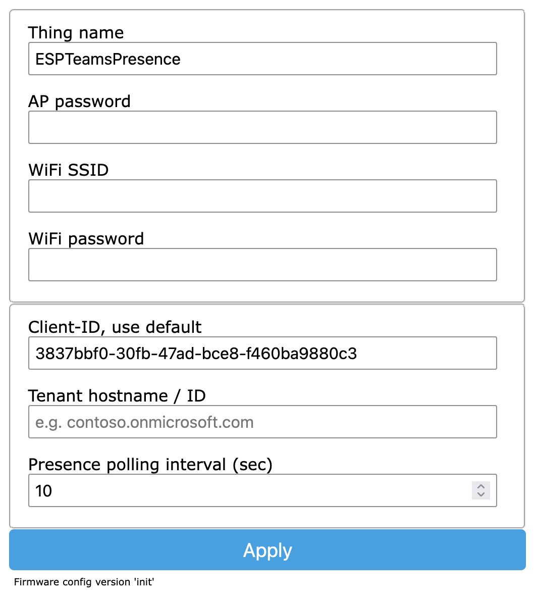
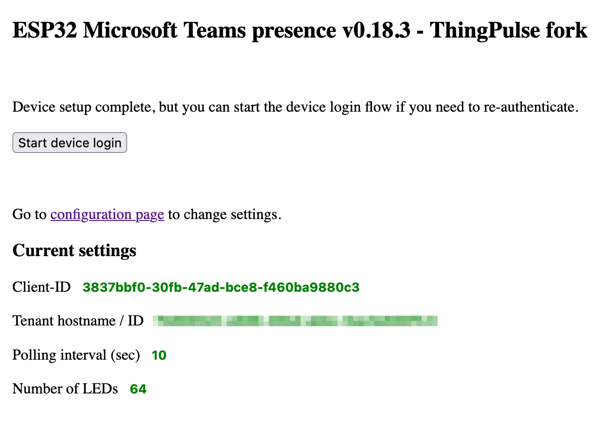

# ESP32 Icon64 MS Teams Presence Light

**This is a fork of [@toblum](https://github.com/toblum)'s standalone Microsoft Teams presence light based on ESP32 and RGB neopixel LEDs for the [ThingPulse Icon64](thingpulse.com/product/icon64/).**

## Install the Icon64 MS Teams Presence app

There are two main ways to install the application onto the Icon64.

### ThingPulse App Fairy

Grab a copy of the [ThingPulse App Fairy](https://github.com/ThingPulse/app-fairy) and select the correct app for the Icon64.

### PlatformIO

The alternative is to fork this repository and compile, link, and flash the application through PlatformIO.

## Configure the Icon64 MS Teams Presence app

The [upstream project](https://github.com/toblum/ESPTeamsPresence) this was forked from has excellent documentation at https://toblum.github.io/ESPTeamsPresence/#/build/setup.
Hence, we are only highlighting a few things here.

### WiFi hotspot

After flashing and rebooting, the device opens a WiFi hotspot. 
Its name is 'ESPTeamsPresence'. 
You should be able to connect to it using your phone or any other WiFi-enabled device using the password 'presence'.

### App configuration

If your phone or computer does not open a configuration diaglog automatically, open a browser window at http://192.168.4.1/config.
You will see a configuration form as depicted below.

**NOTE** that all fields are mandatory!

<kbd></kbd>

The password fields "AP password" and "WiFi password" are protected i.e. you won't see the values you enter in plain text. 
The default AP password is 'presence' as described above.
Feel free to enter the default password again.

For the "Client-ID" we highly recommend to use the default.
The value represents the client ID of the Azure App that is used to connect to Teams. 
The original author [@toblum](https://github.com/toblum) registered a multi-tenant app under the given ID 3837bbf0-30fb-47ad-bce8-f460ba9880c3.
You are welcome to use it and it should work fine. 
Should this ever stop working, please reach out to @toblum, thank him for his efforts and ask whether he be aware of any issues with his Azure App. 
Of course, you are free to [setup your own Azure App](https://github.com/toblum/ESPTeamsPresence/issues/30#issuecomment-1475274011) if you like.

The "Tenant hostname / ID" value is what ties this app to your organization's MS Teams instance.
It is information you usually don't have but [it is fairly easy to obtain it](https://teams.handsontek.net/2019/04/09/how-to-get-microsoft-teams-tenant-id/).
Pick any team in MS Teams, click the "...", then "Get link to team" and extract the value of the "tenantId" parameter from that URL.

Click "Apply" to save everything. 
Disconnect from the device WiFi. 
Power cycle the device to restart it.

### MS Teams authentication

After the device rebooted and connected to your configured WiFi, it is ready to be authenticated against your Microsoft / MS Teams account.

On a mobile phone or your computer connected to the same WiFi as the device open a browser at 'http://\<your-configured-thing-name\>.local/'.
So, by default this is http://espteamspresence.local/.
If this fails, you may try using the device IP address instead.

<kbd></kbd>

Ignore the "Device setup complete..." sentence in the screen shot above and hit the "Start device login" button.
It will take you through the self-explanatory OAuth authentication process.
@toblum has a few screen shots of this in [his documentation](https://toblum.github.io/ESPTeamsPresence/#/build/setup#step-4-connect-to-the-azure-app-using-device-login-flow).

## Libraries used
This project uses the following libraries from different authors:

- [IotWebConf](https://github.com/prampec/IotWebConf) by prampec
- [ArduinoJson](https://github.com/bblanchon/ArduinoJson) by bblanchon
- [WS2812FX](https://github.com/kitesurfer1404/WS2812FX) by kitesurfer1404

Thanks to all the authors.

## Licence
All code is licensed under the [MPLv2 License](https://github.com/toblum/ESPTeamsPresence/blob/master/LICENSE).
